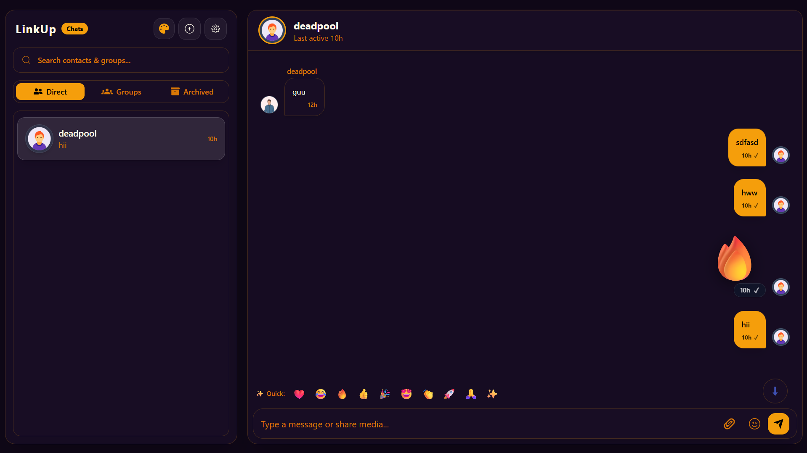

# LinkUp — Realtime Chat Application



LinkUp is a full-stack realtime chat application supporting one-on-one and group messaging, contact management, media/attachment sharing, and audio/video calls.

---

## Tech Stack

### Frontend

|  |  |  |  |  |
|:---:|:---:|:---:|:---:|:---:|
| React 19 | Vite | Redux Toolkit | Tailwind CSS | Socket.io Client |

Additional libraries: React Router, Framer Motion, Jitsi React SDK, Mediasoup Client, React Icons, Emoji Picker React, Axios, Crypto-JS.

### Backend

|  |  |  |  |  |
|:---:|:---:|:---:|:---:|:---:|
| Node.js | Express | Socket.io | JSON Web Token | Cloudinary |

Additional libraries: Mongoose, Multer, Bcrypt, Mediasoup, Nodemailer, Node-Geocoder, Crypto-JS, UUID.

### Database


MongoDB (via MongoDB Atlas / self-hosted, using Mongoose ODM)

---

## Features

- 🔐 **Authentication** — Sign up, login, logout with JWT-based access & refresh tokens
- 🛡️ **Account Security** — Security question setup, forget-password verification, and password reset flow
- 💬 **Realtime Messaging** — One-on-one and group chats powered by Socket.io
- 👥 **Group Management** — Create groups, add/remove members
- 📇 **Contacts** — Search, block/unblock, archive/unarchive contacts
- 📎 **Media & Attachments** — Upload avatars and message attachments via Cloudinary/Multer
- 🎥 **Audio/Video Calls** — WebRTC-based calling via Mediasoup and Jitsi
- 🎨 **Themes** — User-configurable theme preference
- 🚩 **Reporting** — Report users or content
- ✏️ **Profile Management** — Update name, email, search tag, and avatar

---

## Installation

```bash
# 1. Clone the repository
git clone PLACEHOLDER_REPO_URL
cd linkup

# 2. Install backend dependencies
cd Backend
npm install

# 3. Install frontend dependencies
cd ../Frontend
npm install

# 4. Set up environment variables
# Create a .env file in /Backend and /Frontend (see Environment Variables section below)

# 5. Run the backend (development)
cd ../Backend
npm run dev

# 6. Run the frontend (development)
cd ../Frontend
npm run dev
```

The frontend will be available at `http://localhost:5173` and the backend API at `http://localhost:5000`.

---

## Backend Endpoints

Base URL: `/api/v1`

### `/api/v1/user`

| Method | Endpoint | Description | Auth |
| --- | --- | --- | --- |
| POST | `/live-check-mail` | Check email availability during signup | No |
| POST | `/live-check-searchtag` | Check search-tag availability during signup | No |
| POST | `/register` | Register a new user | No |
| POST | `/live-check-searchtag-login` | Validate tag/mail during login | No |
| POST | `/check-user-already-loggedin` | Check existing session | Yes |
| POST | `/login` | Log in | No |
| POST | `/logout` | Log out | Yes |
| POST | `/get-chat-history` | Fetch account/chat history details | Yes |
| POST | `/update-searchtag` | Update search tag | Yes |
| POST | `/update-mail` | Update email | Yes |
| POST | `/update-name` | Update display name | Yes |
| GET | `/set-theme` | Set UI theme preference | Yes |
| POST | `/update-avatar` | Upload/update avatar | Yes |
| POST | `/save-quiz` | Save security Q&A | Yes |
| POST | `/verify` | Verify security answer | Yes |
| POST | `/forget-password` | Initiate password recovery | No |
| POST | `/resat-password` | Reset password | No |

### `/api/v1/chat`

| Method | Endpoint | Description | Auth |
| --- | --- | --- | --- |
| POST | `/save-contact` | Start a one-on-one chat | Yes |
| POST | `/upload` | Upload contact-related file | Yes |
| POST | `/create-group-chat` | Create a group chat | Yes |
| POST | `/block-left` | Block a contact | Yes |
| POST | `/un-block` | Unblock a contact | Yes |
| POST | `/add-to-group` | Add member to group | Yes |
| POST | `/kickout-from-group` | Remove member from group | Yes |
| POST | `/archieve` | Archive a contact/chat | Yes |
| POST | `/un-archieve` | Unarchive a contact/chat | Yes |
| POST | `/update-avatar` | Update group/chat avatar | Yes |
| POST | `/message/send-msg` | Send a message | Yes |
| POST | `/message/attechment-upload` | Upload message attachment | Yes |
| POST | `/message/del-msg` | Delete a message | Yes |

### `/api/v1/contact`

| Method | Endpoint | Description | Auth |
|---|---|---|---|
| POST | `/search` | Search contacts | Yes |

### `/api/v1/report`

| Method | Endpoint | Description | Auth |
|---|---|---|---|
| POST | `/report` | Submit a report | Yes |

---

## Environment Variables

Create a `.env` file in the **Backend** directory with the following keys (replace all values with your own — never commit real secrets):

```dotenv
# MongoDB Connection string
ATLAS_LINK=your_mongodb_connection_string
PORT=5000

# JWT
ACCESS_TOKEN_SECRET=your_access_token_secret
ACCESS_TOKEN_EXPIRY=10d
REFRESH_TOKEN_SECRET=your_refresh_token_secret
REFRESH_TOKEN_EXPIRY=30d

# CORS
CORS_ORIGIN=http://localhost:5173
CORS_ORIGIN_1=http://localhost:80
CORS_ORIGIN_2=http://localhost:8081

# Cloudinary
CLOUDINARY_API_KEY=your_cloudinary_api_key
CLOUDINARY_API_SECRET=your_cloudinary_api_secret
CLOUDINARY_NAME=your_cloudinary_cloud_name

# Geo API
GEO_API=your_geo_api_key
CHAT_SECRET_KEY=your_chat_secret_key
```

Create a `.env` file in the **Frontend** directory with the following keys:

```dotenv
VITE_API_EMOJI_API_KEY=your_emoji_api_key
VITE_API=http://localhost:5000/api/v1
VITE_API_=http://localhost:5000
VITE_API_CHAT_SECRET_KEY=your_chat_secret_key
```

> ⚠️ **Never commit your actual `.env` file.** Add it to `.gitignore` and share only a `.env.example` with placeholder values.

---

## License

This project is licensed under the **PLACEHOLDER_LICENSE** (e.g. MIT). See the [LICENSE](PLACEHOLDER_LICENSE_FILE_URL) file for details.

---

## Support

If you run into issues or have questions:

- 🐛 Open an issue: [contact me](https://vishalsingh.me/contact/?req_from=git)
- 📧 Email: [EMAIL_ADDRESS](mailto:[vishalsinghcode2@gmail.com])

---

<p align="center">Made with ❤️ by <b>Vishal Singh</b></p>
